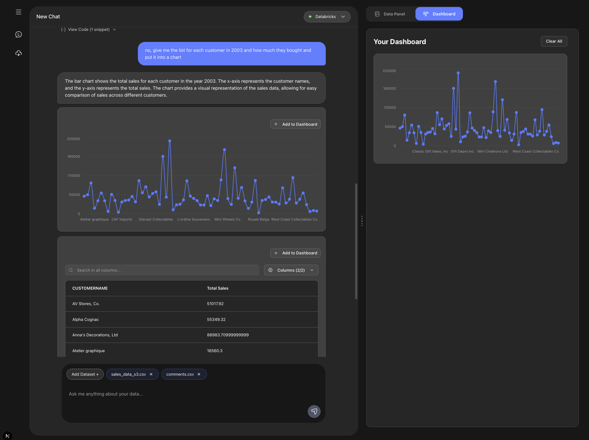

# AI-D-ANTS


AI-D-ANTS is an intelligent data analysis and anomaly detection system designed to interact with millions of documents across various data sources. This powerful tool enables you to map, analyze, and detect anomalies in your data, whether stored locally or in cloud storage like AWS S3.



## Features

- **Multi-Document Processing**: Handle millions of documents efficiently (csv, excel, parquet, delta), the rest of the documents will be coming soon.
- **Anomaly Detection**: Identify patterns and anomalies in your data folders
- **Flexible Data Sources**: Support for local folders and AWS S3 buckets
- **Multiple AI Backends**: Choose between Databricks or local Ollama models
- **Real-time Chat Interface**: Interactive conversation with your data
- **Embedding Database**: Vector storage for semantic search capabilities
- **Keywords search**: Find relevant documents using keyword-based queries
- **RESTful API**: FastAPI-based backend with comprehensive endpoints

## Architecture

The system consists of:
- **FastAPI Backend**: Core API server with data processing capabilities
- **Next.js Frontend**: Modern web interface for user interactions
- **Embedding Database**: Vector storage using DuckDB
- **AI Integration**: Support for both Databricks and Ollama models
- **File Processing**: Advanced parsers for JSON, XML, and Python files to extract the needed informations from AI responses.

## Prerequisites

- Python 3.12+
- Node.js 16+ (for frontend)
- Docker (optional)
- AWS Account (for S3 integration)
- Databricks Account (optional)

## Installation

### Local Development

1. **Clone the repository**
   ```bash
   git clone https://github.com/taharbmn/AI-D-ANTS.git
   cd AI-D-ANTS
   ```

2. **Backend Setup**
   ```bash
   pip install -r requirements.txt
   ```

3. **Frontend Setup**
   ```bash
   cd frontend
   npm install
   cd ..
   ```

4. **Environment Configuration**
   Create a `.env` file in the root directory with the following variables:

### Docker Deployment
NOT READY YET!
```bash
docker-compose up --build
```

## Environment Variables

Create a `.env` file with the following configuration:

```bash
# AWS Configuration
AWS_REGION=
AWS_ACCESS_KEY_ID=
AWS_SECRET_ACCESS_KEY=

# Databricks Configuration
DATABRICKS_BASE_URL=
DATABRICKS_DEFAULT_MODEL=

OLLAMA_DEFAULT_MODEL=qwen3:1.7b

MODEL_TYPE=ollama

# Application Settings
LOG_LEVEL=INFO
DEBUG=False
API_TIMEOUT=30
MAX_RETRIES=3

DATABASE_URL=sqlite:///./app_database.db
```

## Usage

### Starting the Application

**Local Development:**
```bash
python run_local.py
```

**Frontend (separate terminal):**
```bash
cd frontend
npm run dev
```

### Using Different AI Models

**Ollama (Local):**
Set `MODEL_TYPE=ollama` in your environment and ensure Ollama is running locally with your preferred model.

**Databricks:**
Set `MODEL_TYPE=databricks` and configure the Databricks connection parameters.

## Data Sources

### Local Folders
The system can process files from local directories, automatically detecting and parsing various file formats.

### AWS S3
Configure AWS credentials to process files stored in S3 buckets.

## File Processing

AI-D-ANTS supports multiple file formats:
- CSV
- EXCEL
- PARQUET
- DELTA

## Development

### Project Structure

```
├── app/                    # Backend application
│   ├── main.py            # FastAPI application entry point
│   ├── endpoints/         # API route handlers
│   ├── models/            # Database models
│   ├── schemas/           # Pydantic schemas
│   ├── core/              # Core configuration and utilities
│   ├── crud/              # Database operations
│   └── ...
├── frontend/              # Next.js frontend application
├── requirements.txt       # Python dependencies
├── docker-compose.yml     # Docker configuration
└── README.md             # Project documentation
```

### Contributing

1. Fork the repository
2. Create a feature branch
3. Make your changes
4. Add tests if applicable
5. Submit a pull request


## Support

For questions, issues, or contributions, please open an issue on GitHub or contact the maintainers.

